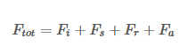
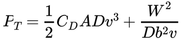

# LAPR3 Project 2020-2021 Grupo 24 Report

# 1. Introdução
***
Na sequência do projeto referente à unidade curricular Laboratório Projeto III foi proposto o desenvolvimento de uma aplicação que visa dinamizar a entrega de produtos farmaceuticos, bem como gerir os clientes, produtos e encomendas de uma rede de farmácias.  

Dada a situação atual, e considerando que o objetivo primordial desta rede de farmácias é a entrega de vacinas para o SARS-CoV-2, de forma a desenvolver uma aplicação que garantisse maior eficiência e fluidez na gestão das entregas e restantes funcionalidades, foram aplicados diversos princípios/metodologias aprendidos ao longo do semestre nas unidades curriculares de Estruturas de Informação (ESINF), Base de Dados (BDDAD), Física Aplicada (FSIAP), Arquitetura de Computadores (ARQCP) e Laboratório Projeto III (LAPR3).  

Desta forma não só foi possível desenvolver uma aplicação capaz de suportar todas as funcionalidades solicitadas eficientemente, como também, todos os envolvidos no projeto puderam aprofundar os seus conhecimentos, aplicando metodologias exploradas no contexto das unidades curriculares, e compreender e explorar a interligação existente entre os conceitos abordados durante o semestre.

Neste documento iremos apresentar uma breve explicação do problema, as metodologias e a organização do grupo, a documentação realizada ao longo do projeto, uma explicação teórica das equações físicas, a solução ao problema e por fim uma conclusão. 

# 2. Descrição do Problema
***
Neste semestre cada grupo deveria criar uma aplicação cujo principal objetivo era dinamizar as entregas de produtos farmaceuticos, nomeadamente, vacinas auto injetáveis de vacinas para o Sars-CoV-2 e gerir clientes, produtos e encomendas.

Desta forma, um utilizador não registado deve inicialmente realizar o registo inserindo os seus dados e credenciais de forma a poder usufruir das funcionalidades da aplicação.

Após estar registado, o Cliente pode visualizar todas as farmácias presentes na aplicação, devendo selecionar uma farmácia para realizar a encomenda dos produtos adicionados ao carrinho. Após selecionar todos os produtos, o Cliente irá realizar o checkout, onde poderá pagar por cartão de crédito ou por créditos - os créditos são gerados automaticamente pelo sistema aquando de uma entrega bem sucedida.

Visto que a aplicação suporta o registo de várias farmácias, houve necessidade de criar um gestor responsável pela gestão dos produtos de cada uma das farmácias. Na eventualidade de um cliente selecionar uma quantidade de produtos superior à disponível na farmácia, é despoletada a transferência de produtos entre farmácias, isto é, será procurada a farmácia mais próxima com stock do produto pretendido, e caso seja possível atingir a farmácia sem qualquer paragem intermédia a transferência será realizada, caso contrário o produto será removido do carrinho e será enviado um e-mail a informar a remoção do produto ao Cliente.

Considerando que a taxa de entrega terá um valor fixo - independente da distância percorrida - as entregas podem ser efetuadas por drone ou por estafeta, consoante a opção que oferece o menor custo energético.

Adicionalmente, é de enfatizar, que a aplicação é gerida por um Administrador, responsável por registar, atualizar e, em alguns casos, remover  farmácias, estacionamentos - estão aptos a receber tanto drones como scooters - e os respetivos gestores, scooters, drones, estafetas e produtos.
 

# 3. Metodologias e Organização do grupo 
***
Dada a dimensão do trabalho foi necessária a adequada organização e divisão de tarefas desde os primeiros momentos. 

A anteceder cada Sprint, todos os membros participavam de uma reunião na qual se identificavam e analisavam as novas informações fornecidas pelo cliente, bem como, se realizava a distribuição de tarefas entre os elementos. No intuito de criar um produto de maior qualidade, as tarefas delegadas a cada membro do grupo tiveram em consideração os seus pontos fortes. No caso específico do Scrum Master foram, também, tidas em consideração as suas restantes funções.

Todos os dias, ao longo da semana, o grupo realizava reuniões diárias (daily scrum), onde se determinava o estado do trabalho; cada membro relatava o que tinha feito no dia, o que ia fazer no dia a seguir e também as dificuldades sentidas até ao momento, que eram discutidas e resolvidas conjuntamente com restantes membros do grupo.

No final de cada Sprint, eram realizadas duas cerimónias, sendo estas, Sprint Review e  Sprint Retrospective. Durante o Sprint Review era analisado o resultado do Sprint e eram determinadas as adaptações futuras. O Scrum master apresentava à equipa as tarefas concluídas do Backlog, alertando sempre que possível para melhorias e para as tarefas em falta.
Durante o Sprint Retrospective eram planeadas abordagens para aumentar a qualidade do trabalho e eficácia dos membros, eram também discutidos os pontos positivos , negativos e possíveis melhorias na metodologia de trabalho.

Dada a complexidade do projeto, ficou evidente a necessidade de utilização de ferramentas organizacionais. Assim, de forma a dividir as várias tarefas entre todos os membros da equipa e planear quais as que a equipa deveria cumprir em cada sprint, utilizámos a ferramenta online “JIRA” e “Bitbucket” para interligar todas as partes do projecto.

# 4. Solução proposta
***

No intuito de resolver o problema previamente explicitado, o grupo baseou-se em conceitos aprendidos em ESOFT - como o modelo de domínio e o diagrama de casos de uso -,em BDDAD - como o modelo de Entidade-Relacionamento - e em PPROG/ESINF - na aplicação das melhores práticas de POO e na escolha das estruturas mais adequadas.

#Modelo de Domínio

## **Racional sobre identificação de associações entre classes** ##

| Conceito (A) 		|  Associação   		|  Conceito (B) |
|----------	   		|:-------------:		|------:       |
| Administrador  	| regista    		 	| Farmácia  |
| | gere os | Meio de Transporte|
| | regista | Estafeta|
| | regista | Gestor de Farmácia|
|  User  					| atua como            | Administrador  |
|  					| atua como     | Gestor de Farmácia|
|						| atua como			| Cliente |
|			| atua como    | Estafeta  |
| Farmácia	|  possui | Endereço  |
|						| tem     			| Produto  |
|  | tem transferências entre     | Farmácia  |
|  | possui | Estacionamento |
|    | emprega | Estafeta |
|   | realiza transferencia | TransferenciaProduto |
| Gestor de Farmácia  | gere | Farmácia |
|  | gere | Produtos Farmácia |
| Endereco | possui  | Coordenadas |
| Cliente | tem | CartaoCredito |
| | mora | Endereco|
| | compra | Produto|
| | encomenda | Encomenda|
| Utilizador Não Registado | regista-se como | Cliente|
| Estaciomento | tem | Slot Estacionamento|
|  | possui | Slot Estacionamento|
|  | estaciona | Slot Estacionamento |
|  | carrega | Slot Estacionamento |
| | realiza |Entrega|
| Scooter | é | Meio de Transporte|
|  | tem| CodigoQR|
| Drone | é | Meio de Transporte|
|  | tem| CodigoQR|
|Estafeta| executa |Entrega|
|  | utiliza | Scooter |
|Entrega| contém |Encomenda| 
|Encomenda| gera| Fatura|
|  | contém | Produto|

Na realização do modelo de dominio , o grupo identificou os conceitos de negocio relevantes , tendo em conta as suas relações.

#Modelo Entidade Relacionamento

No modelo de entidade relacionamento encontram-se as tabelas , os seus atributos e os seus constraints.

Neste modelo foi necessário criar algumas tabelas intermediárias para as relações muitos para muitos, como por exemplo:
 * produto_Encomenda : serve para guardar os produtos para cada encomenda de um cliente.

 * entrega_Encomendas : serve para guardar as encomendas que vão ser entregues em cada entrega. 

 * transferencia_Produto : serve para guardar o produto a ser transferido de uma farmácia fornecedora para a recetora.

 * produto_Farmacia : serve para guardar os produtos que cada farmácia dispõe. 

Para a normalização do modelo relacional aplicou-se a terceira forma normal.
   
No modelo foram também criadas as tabelas de utilizador e de meio_Transporte para generalizar, sendo que os vários utilzadores da plataforma (estafeta,cliente,administrador e gestor da farmácia) tinham vários elementos em comum para não se estar sempre a repetir nas tabelas respetivas a cada tipo de utilizador.
Já a tabela meio_Transporte possui todas as carasteristícas dos drones e das scooters comuns entre si.

# Diagrama de Casos de Uso

- Diagrama com as user stories de cada persona envolvente no projeto.

#  Casos de Uso
| UC   | Descrição:                                                                   | Responsável/Responsáveis:  |  
|:---- |:-----------------------------------------------------------------------------|----------------------------|
| UC1  | [Adicionar Scooter](docs/UseCases/UC1/UC1.md) |1190975|
| UC2  | [Remover Scooter](docs/UseCases/UC2/UC2.md) |1190975|
| UC3  | [Atualizar Scooter](docs/UseCases/UC3/UC3.md) |1190975|
| UC4  | [Inserir Farmácia](docs/UseCases/UC4/UC4.md) |1190977|
| UC5  | [Inserir Capacidade Estacionamento](docs/UseCases/UC5/UC5.md) |1190977|
| UC6  | [Editar Farmácia](docs/UseCases/UC6/UC6.md) |1190424|
| UC7  | [Registar Gestor Farmácia](docs/UseCases/UC7/UC7.md) |1190977|
| UC8  | [Inserir Estafeta](docs/UseCases/UC8/UC8.md) |1190424|
| UC9  | [Editar Estafeta](docs/UseCases/UC9/UC9.md)|1190424|
| UC10 | [Inserir Produto](docs/UseCases/UC10/UC10.md) |1191118|
| UC11 | [Editar Produto](docs/UseCases/UC11/UC11.md)|1191118|
| UC12 | [Transferir entre Farmácias](docs/UseCases/UC12/UC12.md)|1191118 e 1190549|
| UC13 | [Verificar Encomenda Entregue](docs/UseCases/UC13/UC13.md)|1191118|
| UC14 | [Atribuir Créditos](docs/UseCases/UC14/UC14.md)  |1191118|
| UC15 |[Adicionar Produto à Farmácia](docs/UseCases/UC15/UC15.md)    |1190424|
| UC16 | [Remover Produto da Farmácia](docs/UseCases/UC16/UC16.md)   |1190424|
| UC17 | [Atualizar o Stock](docs/UseCases/UC17/UC17.md) |1191118|
| UC18 | [Determinar a Rota de Menor Custo](docs/UseCases/UC18/UC18.md)  |1181055|
| UC19 | [Obter Encomendas](docs/UseCases/UC19/UC19.md)  |1181055|
| UC20 | [Calcular Custo Energético](docs/UseCases/UC20/UC20.md)|1181055|
| UC21 | [Estacionar Transporte](docs/UseCases/UC21/UC21.md)|1190977|
| UC24 | [Registar Cliente](docs/UseCases/UC24/UC24.md)  |1190549|
| UC25 | [Atualizar Informações do Cliente](docs/UseCases/UC25/UC25.md)  |1190975|
| UC26 | [Login do Utilizador ](docs/UseCases/UC26/UC26.md)  |1190549|
| UC27 | [Mudar Palavra-Passe](docs/UseCases/UC27/UC27.md)  |1190975|
| UC28 | [Atualizar Cartão de Crédito](docs/UseCases/UC28/UC28.md)  |1190975|
| UC29 | [Pagar Encomenda com Cartão de Crédito](docs/UseCases/UC29/UC29.md)  |1190549|
| UC30 | [Pagar Encomenda com Créditos](docs/UseCases/UC30/UC30.md)  |1190549|
| UC31 | [Adicionar Produto ao Carrinho de Compras](docs/UseCases/UC31/UC31.md)  |1190549|
| UC32 | [Remover Produto ao Carrinho de Compras](docs/UseCases/UC32/UC32.md)  |1190975|
| UC33 | [Adicionar Slot de Estacionamento para Scooter](docs/UseCases/UC33/UC33.md)  |1190977|
| UC34 | [Adicionar Slot de Estacionamento para Drone](docs/UseCases/UC34/UC34.md)  |1190977|
| UC35 | [Adicionar Drone](docs/UseCases/UC35/UC35.md)  |1190424|
| UC36 | [Editar Drone](docs/UseCases/UC36/UC36.md)  |1190424|
| UC37 | [Remover Drone](docs/UseCases/UC37/UC37.md)  |1190424|
| UC38 | [Criar Entrega](docs/UseCases/UC38/UC38.md)  |1181055|
| UC39 | [Remover Perfil do Cliente](docs/UseCases/UC39/UC39.md)  |1190975|

# Física 

Para os cálculos energéticos da scooter, foi usado o seguinte modelo para calcular a energia total:

onde a potência total é dada pelo produto da força total pela velocidade,  
   
e  

  
com   
  
Dado que foi considerada uma velocidade constante,a força de inércia será sempre 0. Portanto,
não foi considerada para os cálculos.

A força de inclinação da estrada (road slope force), é dada por,   
  
onde  
  
A força de carga (road load force), é dada por,  
    
onde,   
   
A força de atrito aerodinâmico (aerodynamic drag force) é dada por,   
   
onde,   
   
Nesta equação foi considerada a velocidade do vento. Para tal, foi calculado o produto escalar entre a velocidade do corpo em movimento com a velocidade do vento[1][3].

Para o caso do drone, foram considerados os casos de viagem horizontal e aterragem/levantamento.

Para o cálculo da potência no caso do voo horizontal, foi usada a seguinte fórmula:   
  

onde CD é o coeficiente de atrito aerodinâmico,
A é a área frontal do drone em m2,
D é a densidade do ar em Kg/m3,
v é a velocidade do veículo relativa considerando a velocidade do vento e direção, em m/s, b é a 
largura do veículo. W é o peso total no veículo.

Para o movimento vertical, foi usada a seguinte fórmula   
   
onde T = peso * g (constante de aceleração da gravidade) em Newton,
D é a densidade do ar em Kg/m3, e c é a área
do veículo em face com o levantamento.

A energia foi calculada da mesma forma de como foi para a scooter,
recorrendo à mesma fórmula.[2]

Para o processo de carregamento de scooter e de drones foi usado as seguintes fórmulas:

em que o Tempo vai ser em horas, E que é a energia em kWh e o P a potência em kW.

Já a expressão acima serve para calcular o tempo de recarga tendo em conta a carga atual de um meio de transporte.

# 5. Conclusão
***

No decorrer do relatório foram abordadas as etapas que caracterizaram o processo de desenvolvimento de uma solução para o problema proposto.

Considerando as circunstâncias enfrentadas na atualidade, a possibilidade de entrega ao domicílio assume uma maior importância pelo que, ao desenvolver esta aplicação, pretendeu-se criar uma forma de tornar as rotas de entregas o mais eficiente possivel,garantindo uma melhor experiência de utilizador.

Dada a complexidade do projeto, conforme demonstrado ao longo deste relatório,o recurso a ferramentas organizacionais, influenciou positivamente a dinâmica do grupo, facilitando a distribuição das tarefas entre todos os membros da equipa e garantindo o cumprimento dos objetivos.

O empenho e dedicação de cada membro do grupo permitiu a conclusão atempada dos objetivos de cada sprint o que possibilitou a revisão do trabalho desenvolvido e subsequentemente a implementação de melhorias propostas, aumentando a qualidade do projeto. 

Concluindo, apesar das dificuldades sentidas durante o projeto, foi possível obter um resultado final satisfatório. Embora, certamente, existam alguns problemas técnicos, atingiram-se os principais objetivos para este projeto.

# 6. Referências 
***

[1] X-engineer.org. 2021. EV design – energy consumption – x-engineer.org. [online] Available at: https://x-engineer.org/automotive-engineering/vehicle/eletric-vehicles/ev-design-energy-consumption/ [Accessed 31 January 2021].

[2] Springer.com. 2021 UAV - energy comsumption - springer.com. [online] Available at: https://link.springer.com/chapter/10.1007/978-3-319-99996-8_16 [Accessed: 31- Jan- 2021].

[3]"Rolling resistance", En.wikipedia.org, 2021. [Online]. Available: https://en.wikipedia.org/wiki/Rolling_resistance. [Accessed: 31- Jan- 2021].
