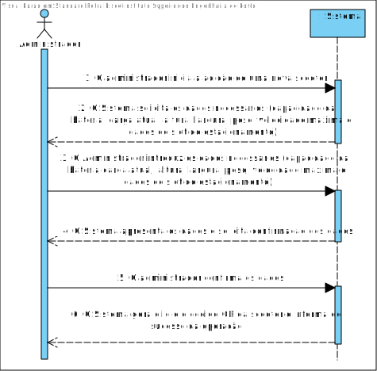
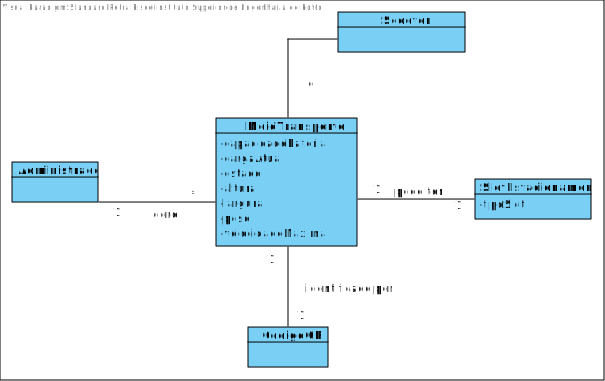
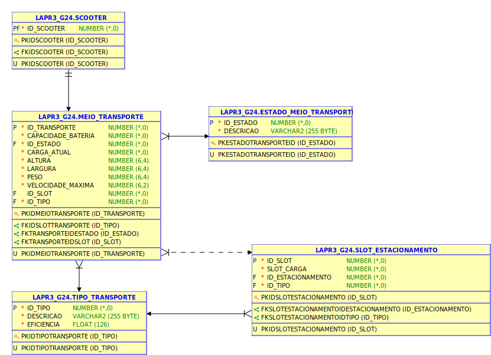
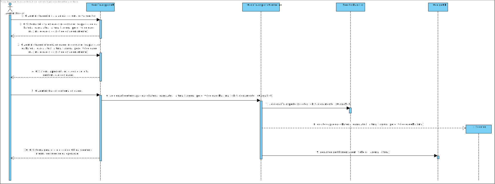
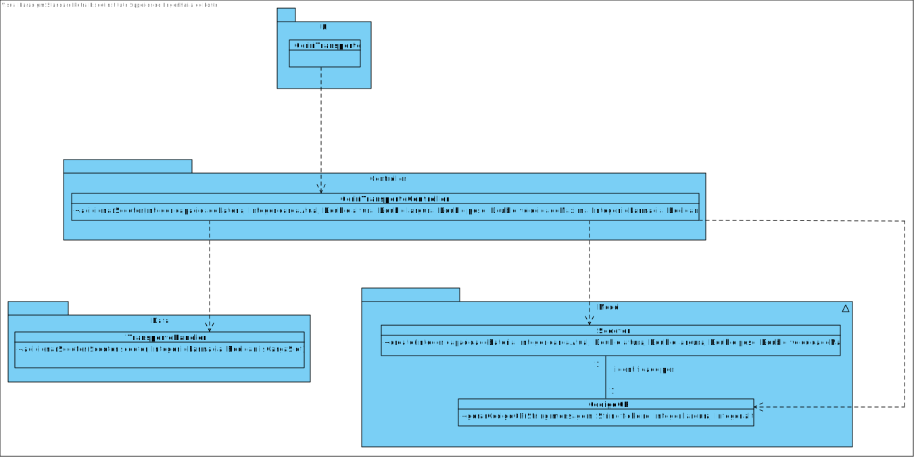

# **UC1 - Adicionar Scooter**

#### `JIRA Issue: ` [_Como administrador pretendo adicionar scooters elétricas à lista de scooters elétricas_](https://jira.dei.isep.ipp.pt/browse/LAP3AP5-20)
# **1. Analise**

**SSD**

**Modelo de Domínio**

# **Ator principal**

Administrador

# **2. Design**

**Modelo Relacional**

**Diagrama de Sequência**

**Diagrama de Classes** 

