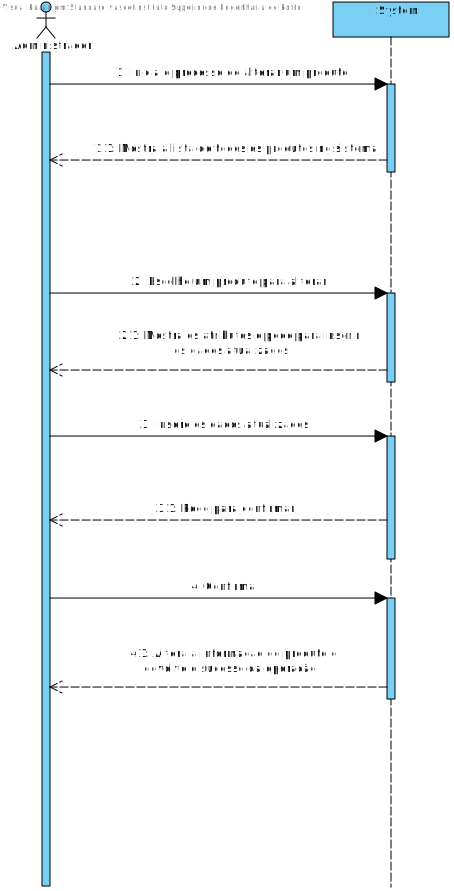
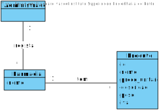
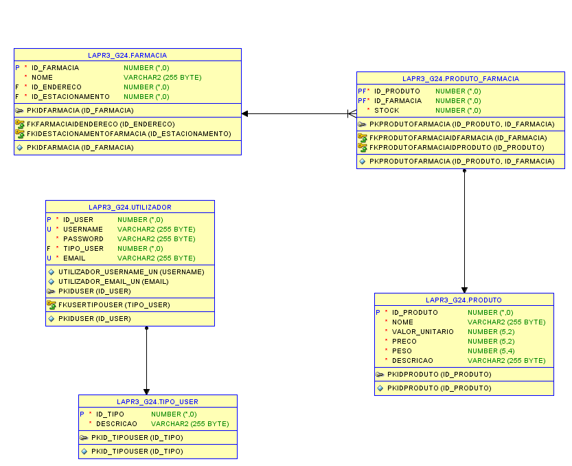
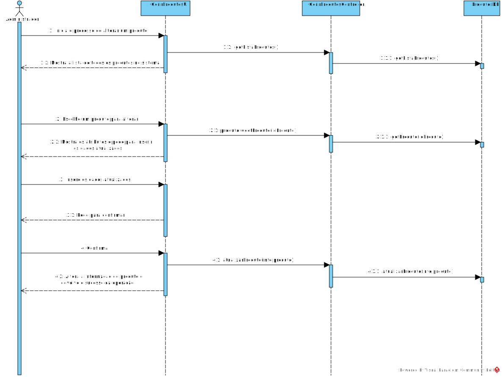
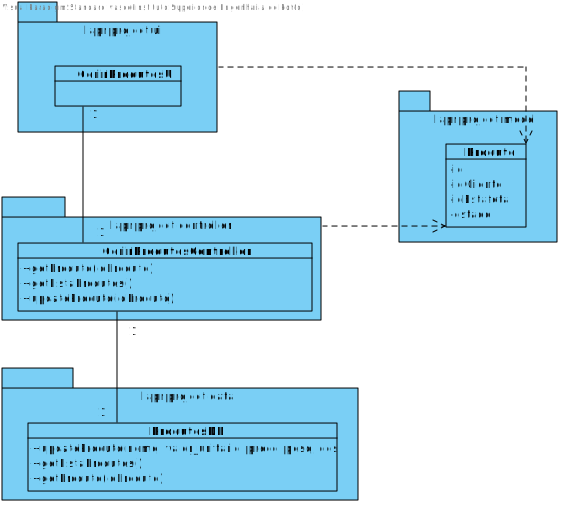

# **UC11 Administrador edita os produtos da plataforma**

#### `JIRA Issue: ` [_Como administrador quero editar dados de um produto da plataforma_](https://jira.dei.isep.ipp.pt/browse/LAP3AP5-247)
# **1. Analise**

**SSD**

**Modelo de Domínio**

# **Ator principal**

Administrador

# **2. Design**

** Modelo Entidade-Relacional**

**Diagrama de Sequência**

**Diagrama de Classes** 

