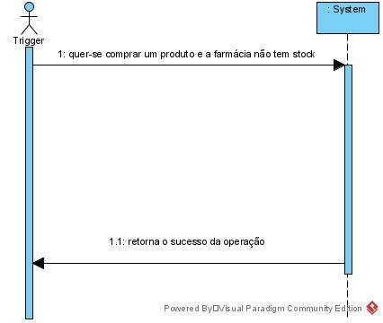
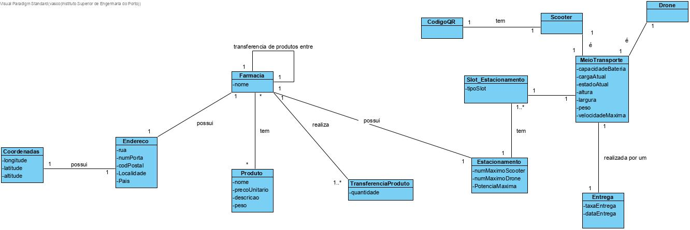
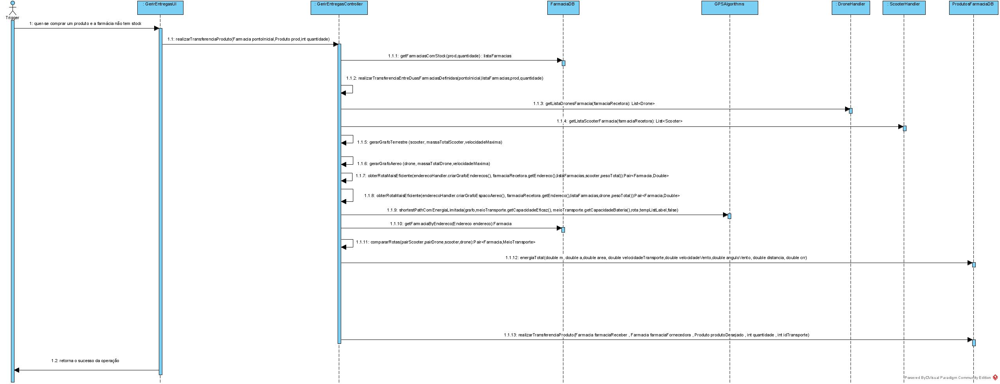
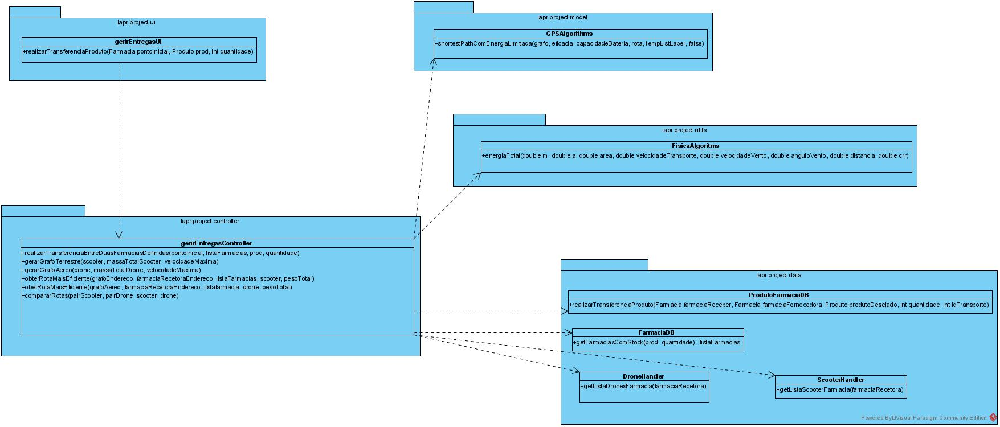

# **UC12 Realização da transferência de produtos entre farmácias**

#### `JIRA Issue: ` [_Como gestor da farmácia pretendo realizar transferências produtos de forma a satisfazer pedidos de cliente_](https://jira.dei.isep.ipp.pt/browse/LAP3AP5-283)
# **1. Analise**

**SSD**

**Modelo de Domínio**

# **Ator principal**

Trigger

# **2. Design**

**Diagrama Entidade-Relational**

**Diagrama de Sequência**

**Diagrama de Classes** 

