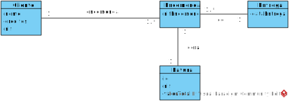

 # **UC14 Gerar créditos**

#### `JIRA Issue: ` [_Como administrador quero atribuir créditos ao cliente_](https://jira.dei.isep.ipp.pt:8443/browse/LAP3AP5-23)
# **1. Analise**

**SSD**

**Modelo de Domínio**

# **Ator principal**

Administrador

# **2. Design**

**Diagrama Entidade-Relacional**

**Diagrama de Sequência**

**Diagrama de Classes** 

