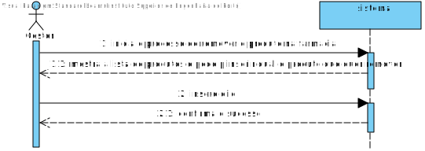
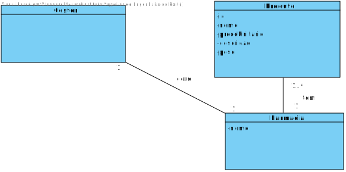
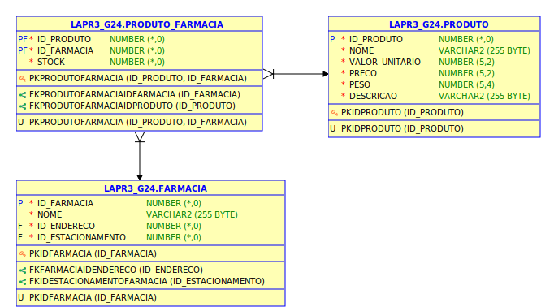
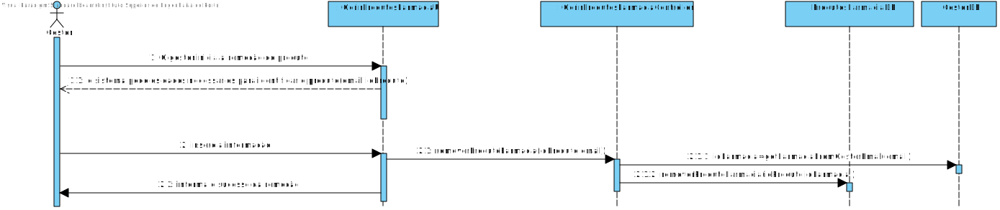
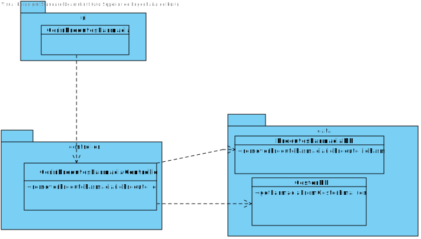

# **UC16 - Remover Produto da Farmácia**

#### `JIRA Issue: ` [_Como gestor pretendo remover produto da farmacia_](https://jira.dei.isep.ipp.pt/browse/LAP3AP5-165)

# **1. Analise**

**SSD**

**Modelo de Domínio**

# **Ator principal**

Gestor

# **2. Design**

**Modelo Relacional**

**Diagrama de Sequência**

**Diagrama de Classes** 

