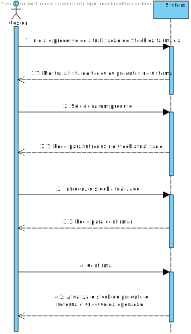
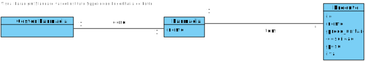
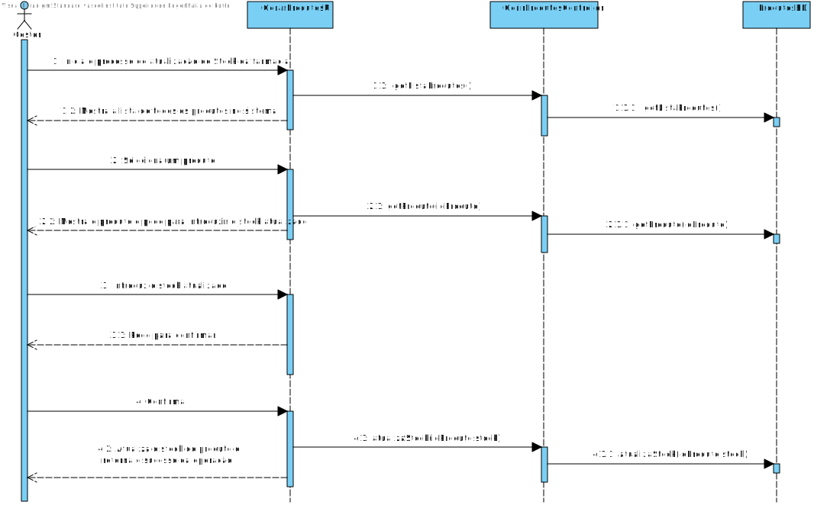
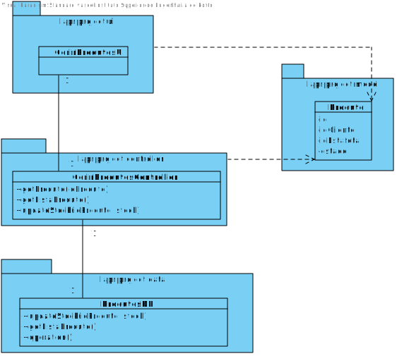

# **UC17 Atualizar Stock**

#### `JIRA Issue: ` [_Como gestor da farmácia desejo atualizar o stock do produto assim que este é entregue na farmácia_](https://jira.dei.isep.ipp.pt/browse/LAP3AP5-167)
# **1. Analise**

**SSD**

**Modelo de Domínio**

# **Ator principal**

Gestor da Farmácia

# **2. Design**

**Diagrama de Sequência**

**Diagrama de Classes** 

