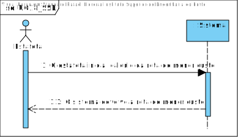
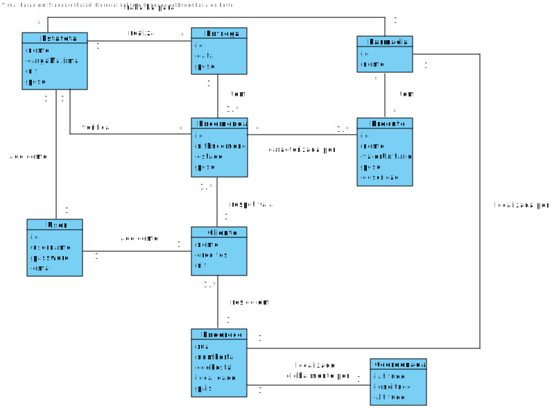
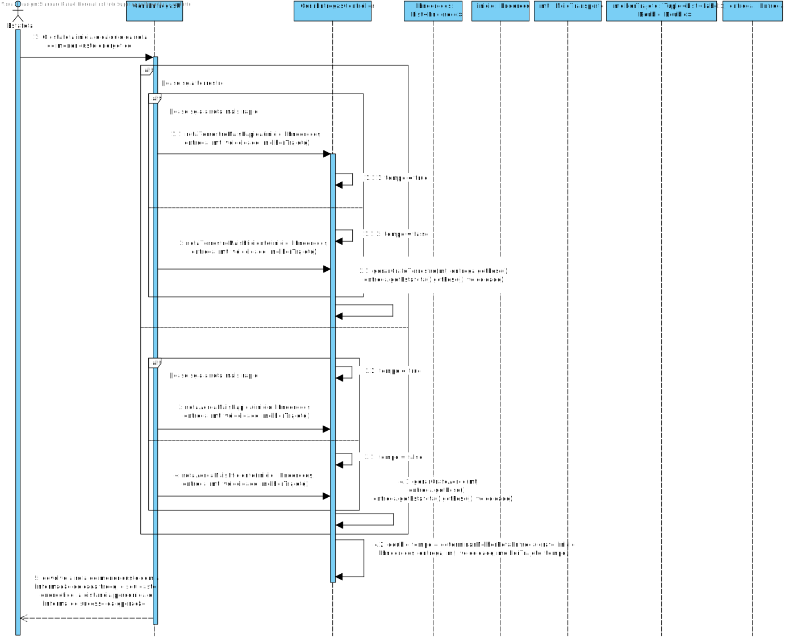
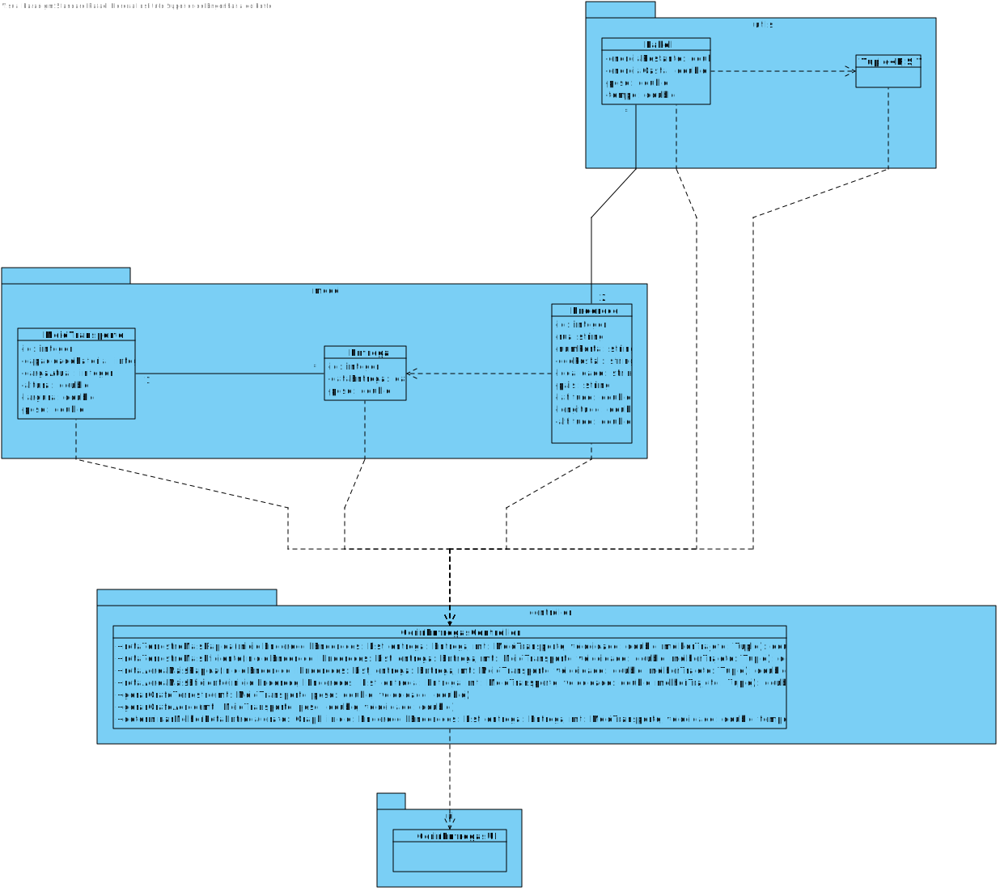

# **UC18 - Determinar a Rota de Menor Custo**

#### `JIRA Issue: ` [_Como estafeta, desejo que seja definida a rota que gasta o mínimo de energia possível, para que os custos associados sejam reduzidos._](https://jira.dei.isep.ipp.pt/browse/LAP3AP5-39)
# **1. Analise**

**SSD**

**Modelo de Domínio**

# **Ator principal**

Estafeta

# **2. Design**

** Diagrama Entidade-Relacional **

**Diagrama de Sequência**

**Diagrama de Classes** 

