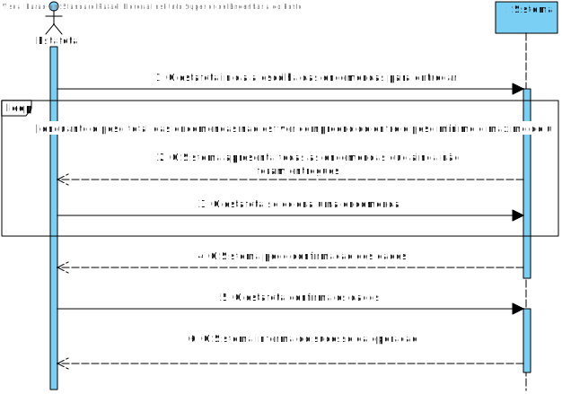
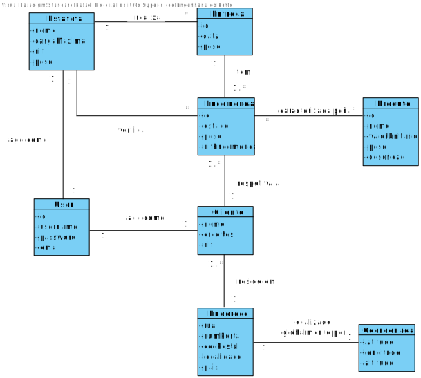
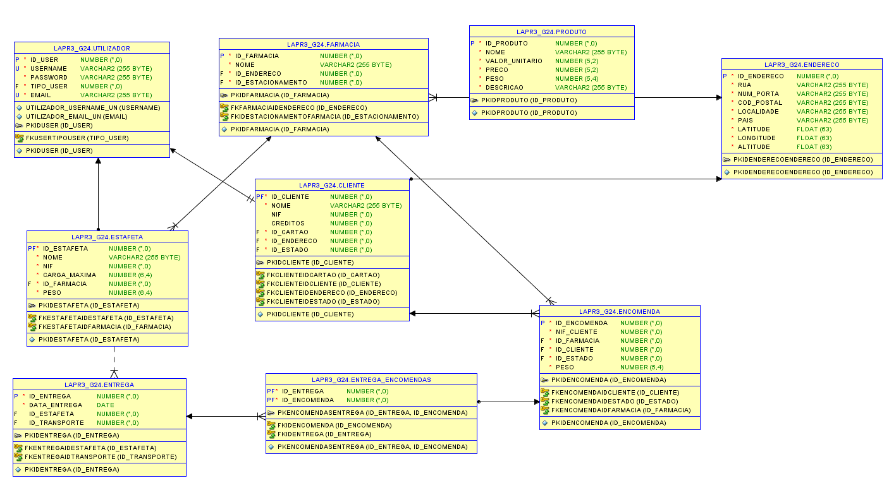
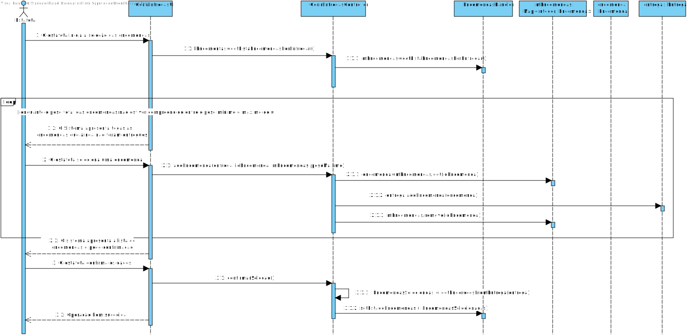
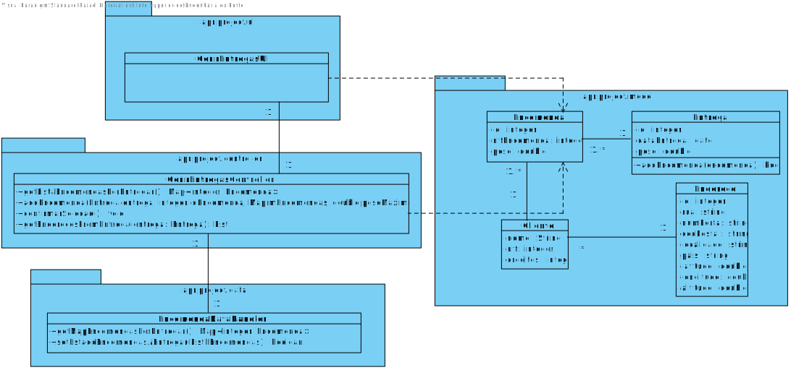

# **UC19 - Obter encomendas**

#### `JIRA Issue: ` [_Como Estafeta, desejo conhecer o número de pedidos e quais os clientes associados a uma entrega e selecioná-las, para que todos os clientes recebam a encomenda._](https://jira.dei.isep.ipp.pt/browse/LAP3AP5-108)
# **1. Analise**

**SSD**

**Modelo de Domínio**

# **Ator principal**

Estafeta

# **2. Design**

** Diagrama Entidade-Relacional **

**Diagrama de Sequência**

**Diagrama de Classes** 

