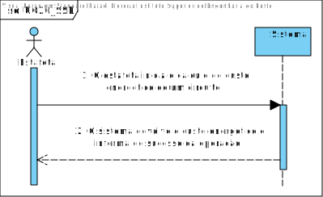
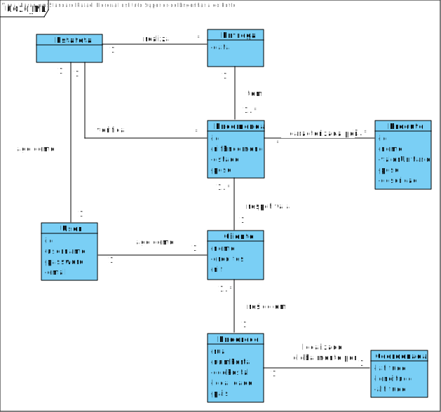
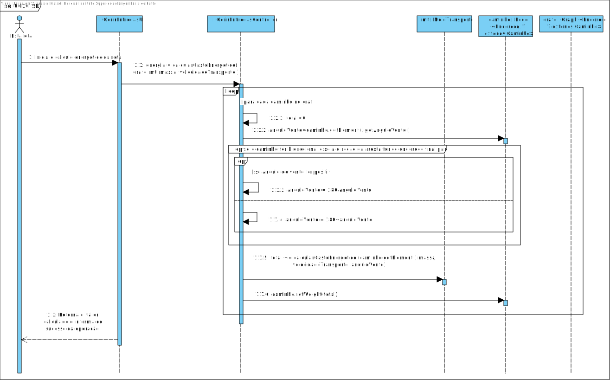
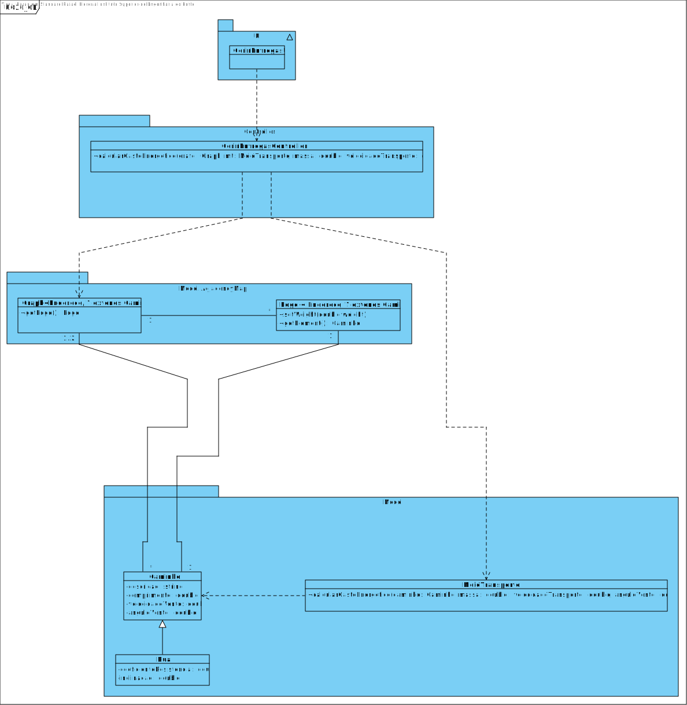

# **UC20 -  Calcular Custo Energético**

#### `JIRA Issue: ` [_Como estafeta, desejo que sejam estimado os custos energéticos de cada entrega, para que seja gasto o mínimo de energia._](https://jira.dei.isep.ipp.pt/browse/LAP3AP5-109)
# **1. Analise**

**SSD**

**Modelo de Domínio**

# **Ator principal**

Estafeta

# **2. Design**

** Diagrama Entidade-Relacional **

**Diagrama de Sequência**

**Diagrama de Classes** 

