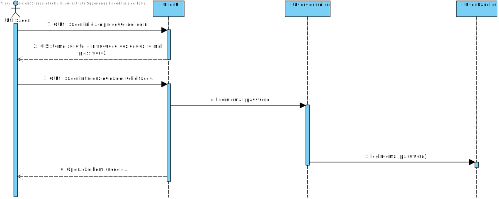

# **UC26 - Efetuar Login**

#### `JIRA Issue: ` [_Como utilizador registado na plataforma quero realizar login na plataforma_](https://jira.dei.isep.ipp.pt/browse/LAP3AP5-374)
# **1. Analise**

**SSD**

**Modelo de Domínio**

# **Ator principal**

Utilizador Registado

# **2. Design**

**Modelo Relacional**

**Diagrama de Sequência**

**Diagrama de Classes** 

