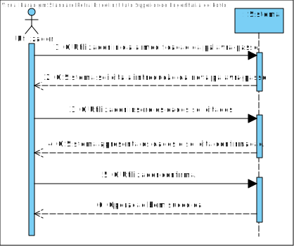

# **UC27 - Mudar Password**

#### `JIRA Issue: ` [_Como Utilizador pretendo mudar de palavra passe_](https://jira.dei.isep.ipp.pt/browse/LAP3AP5-194)
# **1. Analise**

**SSD**

**Modelo de Domínio**

# **Ator principal**

Utilizador

# **2. Design**

**Modelo Relacional**

**Diagrama de Sequência**

**Diagrama de Classes** 

