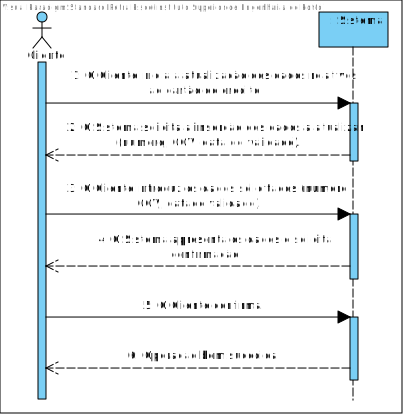
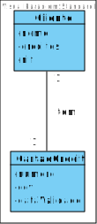
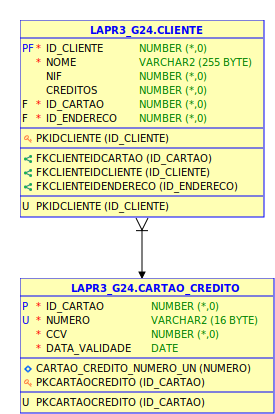
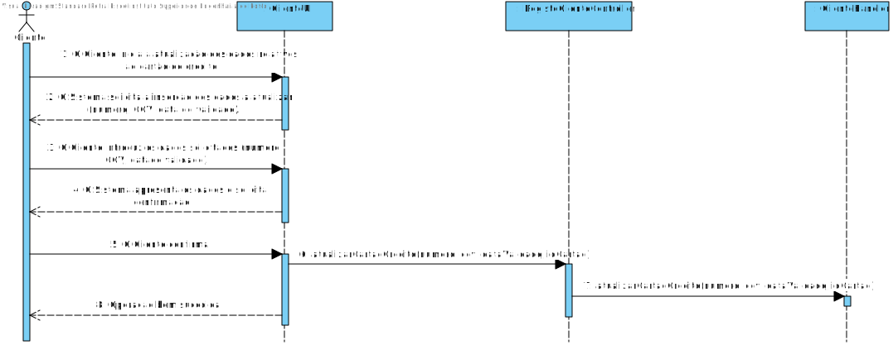
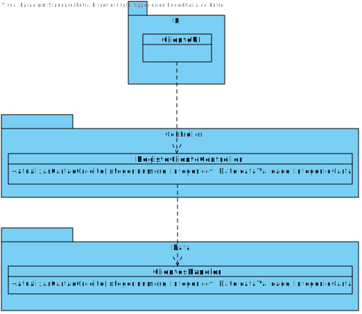

# **UC28 - Atualizar Cartão de Crédito**

#### `JIRA Issue: ` [_Como administrador pretendo atualizar o cartão de crédito_](https://jira.dei.isep.ipp.pt/browse/LAP3AP5-199)
# **1. Analise**

**SSD**

**Modelo de Domínio**

# **Ator principal**

Administrador

# **2. Design**

**Modelo Relacional**

**Diagrama de Sequência**

**Diagrama de Classes** 

