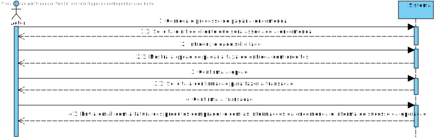
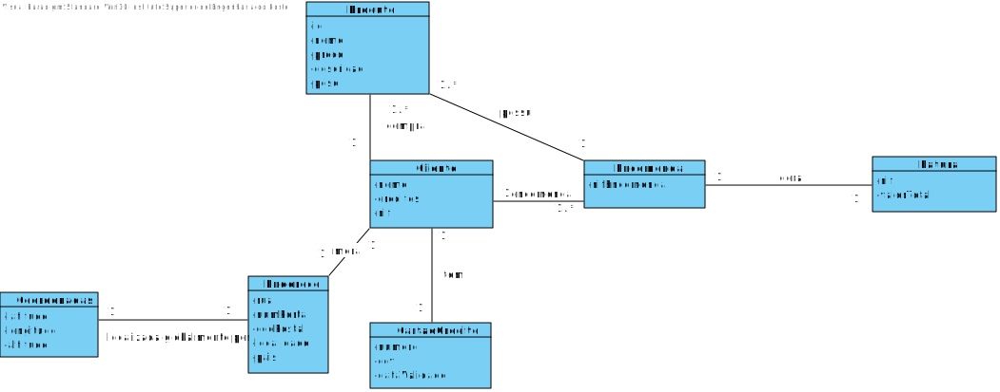
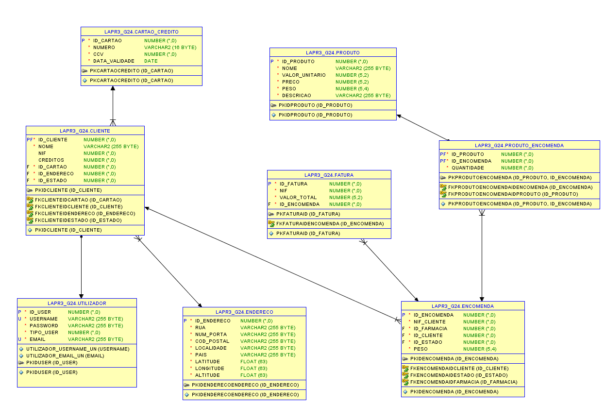
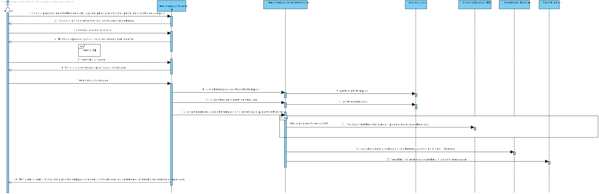
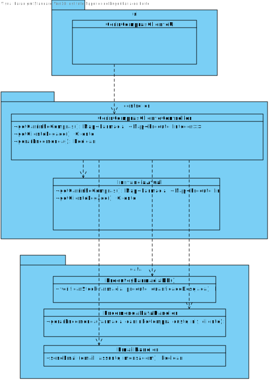

# **UC29 Pagar produtos da encomenda com Cartao**

#### `JIRA Issue: ` [_Como cliente quero pagar os produtos desejados  recorrendo ao cartão de credito associado_](https://jira.dei.isep.ipp.pt/browse/LAP3AP5-9)
# **1. Analise**

**SSD**

**Modelo de Domínio**

# Ator principal

Cliente

# **2. Design**

**Modelo Relacional**

**Diagrama de Sequência**

**Diagrama de Classes** 

