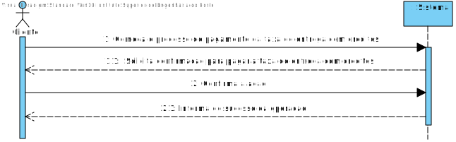
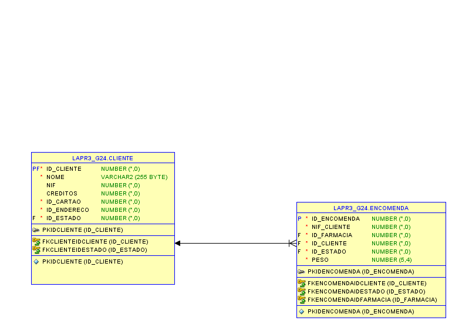
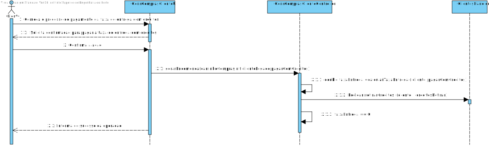
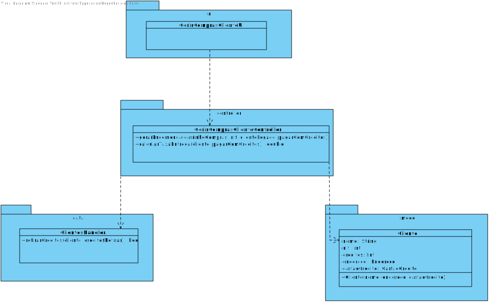

# **UC30 Usar Créditos para pagar taxa de encomenda**

#### `JIRA Issue: ` [_Como cliente quero usar os creditos que possuo para pagar o transporte da encomenda_](https://jira.dei.isep.ipp.pt/browse/LAP3AP5-184)
# **1. Analise**

**SSD**

**Modelo de Domínio**

# Ator principal

Cliente

# **2. Design**
**Modelo Relacional**

**Diagrama de Sequência**

**Diagrama de Classes** 

