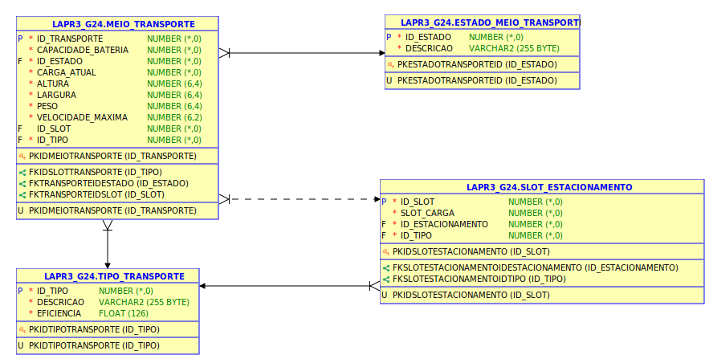

# **UC37 - Remover Drone**

#### `JIRA Issue: ` [_Como administrador pretendo remover drones da lista de drones _](https://jira.dei.isep.ipp.pt/browse/LAP3AP5-280)
# **1. Analise**

**SSD**

**Modelo de Domínio**

# **Ator principal**

Administrador

# **2. Design**

**Modelo Relacional**

**Diagrama de Sequência**

**Diagrama de Classes** 

