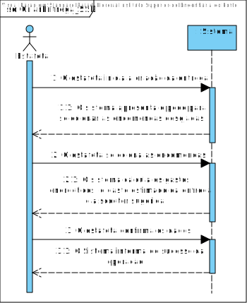
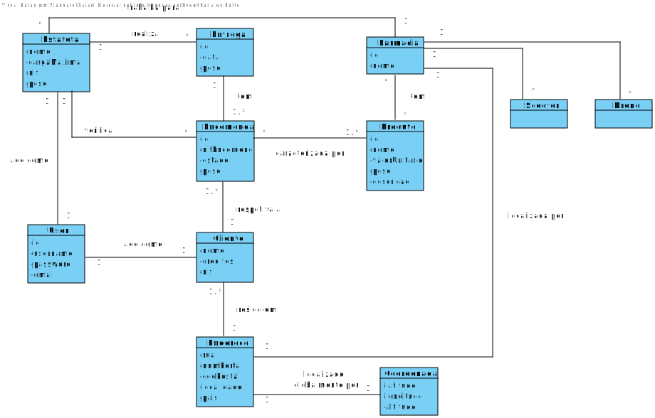
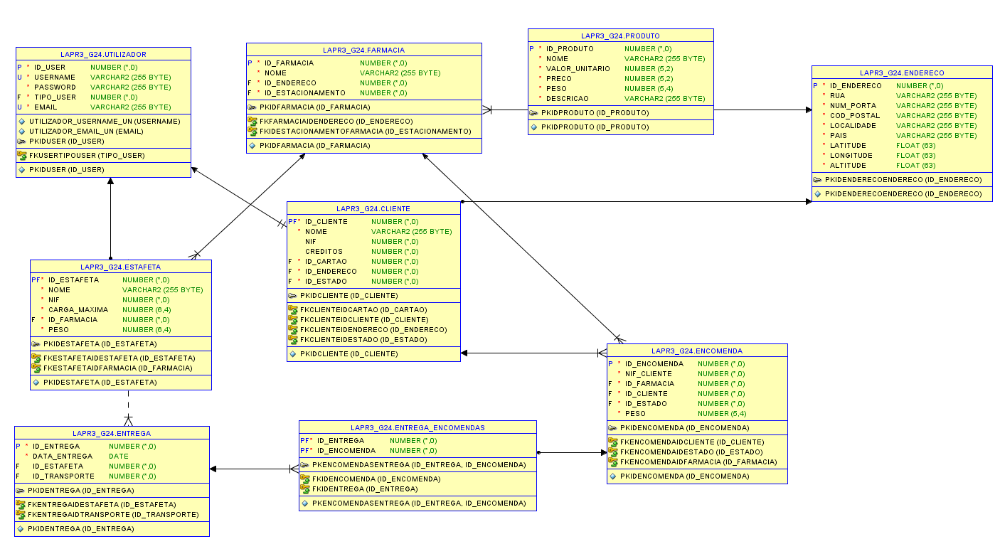
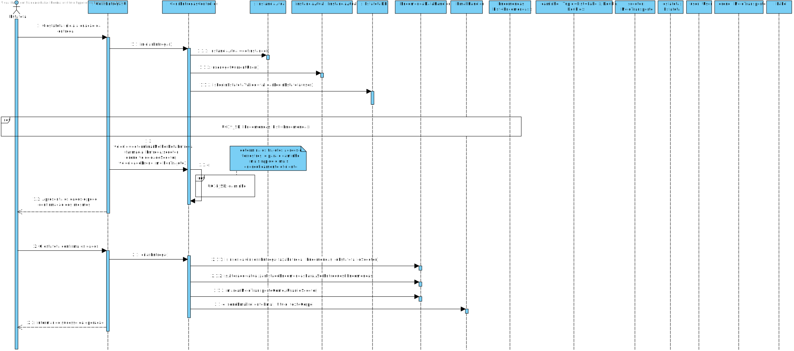
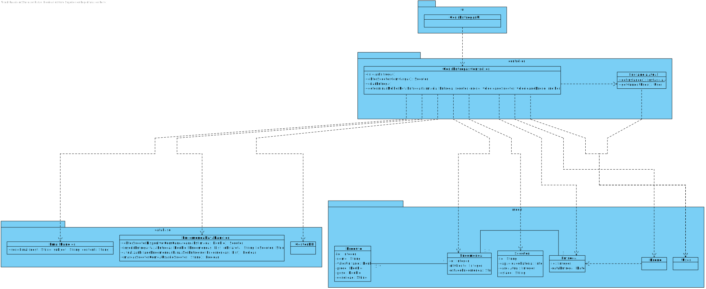

# **UC38 - Criar Entrega**

#### `JIRA Issue: ` [_Como estafeta pretendo criar entrega _](https://jira.dei.isep.ipp.pt/browse/LAP3AP5-363)
# **1. Analise**

**SSD**

**Modelo de Domínio**

# **Ator principal**

Estafeta

# **2. Design**

**Diagrama Entidade-Relational **

**Diagrama de Sequência**

**Diagrama de Classes** 

