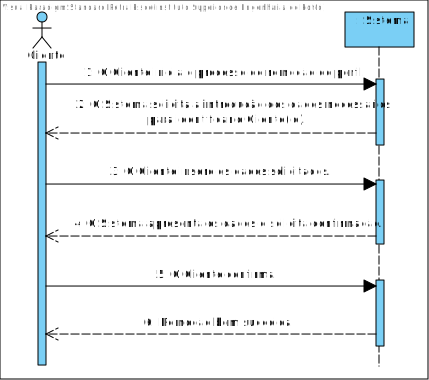
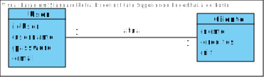
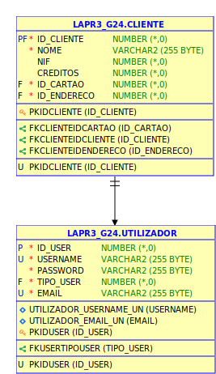
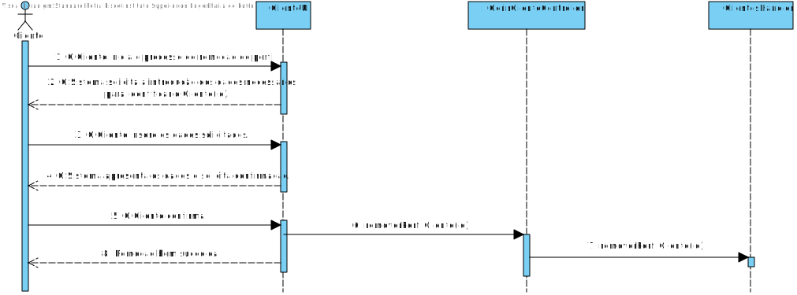
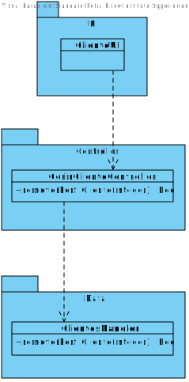

# **UC39 - Remover Perfil do Cliente**

#### `JIRA Issue: ` [_Como cliente pretendo apagar o meu perfil_](https://jira.dei.isep.ipp.pt/browse/LAP3AP5-122)
# **1. Analise**

**SSD**

**Modelo de Domínio**

# **Ator principal**

Cliente

# **2. Design**

**Modelo Relacional**

**Diagrama de Sequência**

**Diagrama de Classes** 

