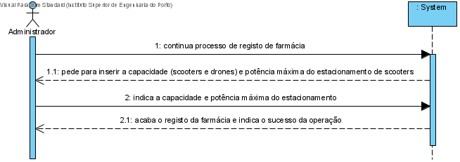
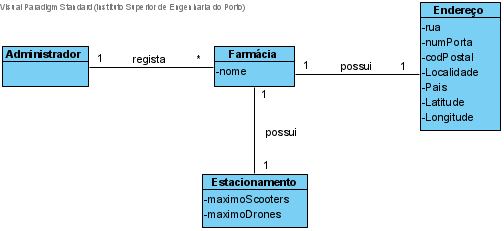
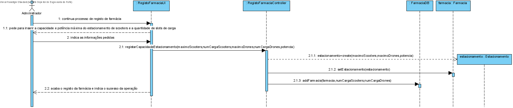
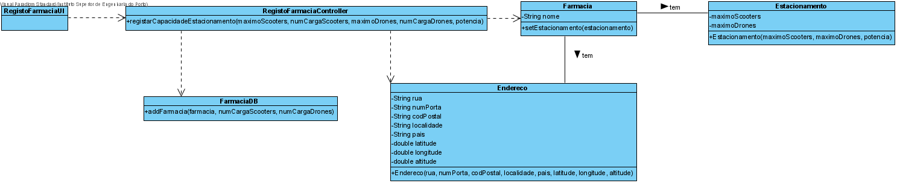

# UC5 - Administrador insere capacidade máxima do estacionamento

#### `JIRA Issue: ` [_Como administrador pretendo adicionar uma farmacia_](https://jira.dei.isep.ipp.pt/browse/LAP3AP5-17)
### 1. Análise

**SSD**

**MD**

### Ator principal
Administrador

### 2. Design

**Modelo de domínio**

**SD**

**CD**
